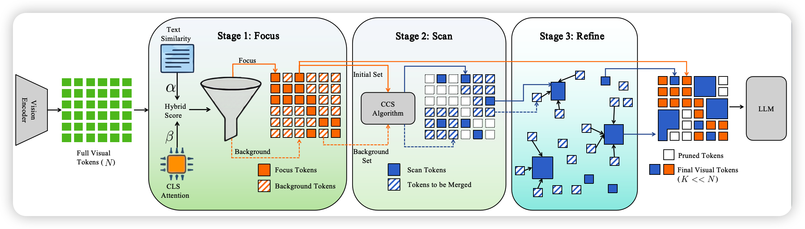
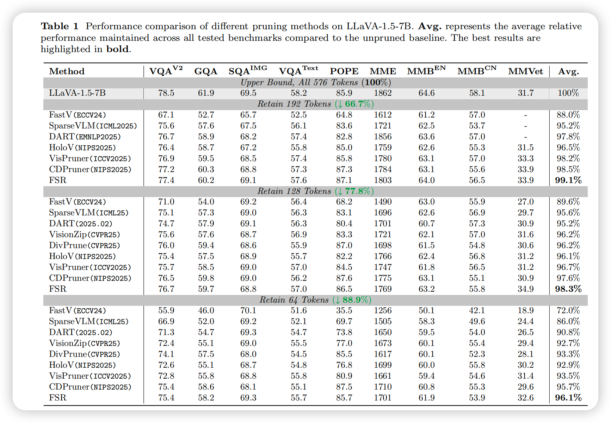
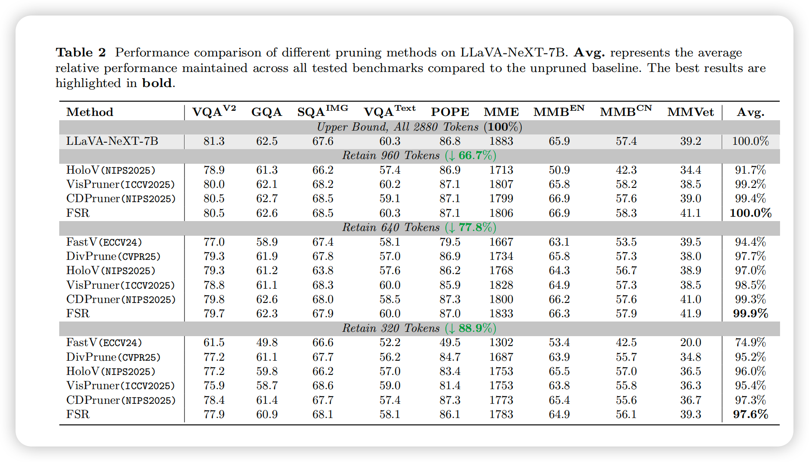
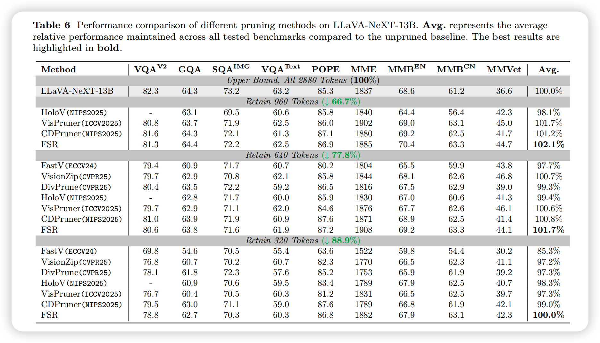
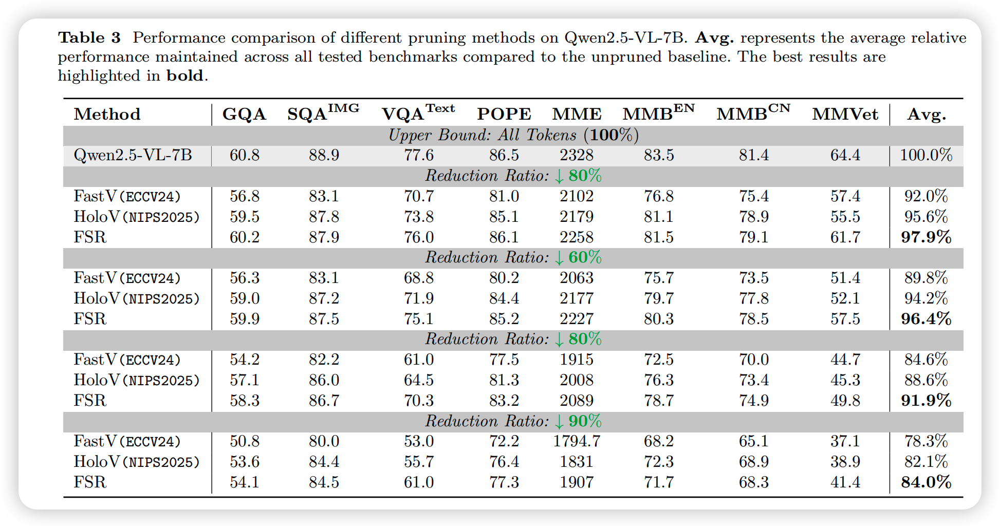
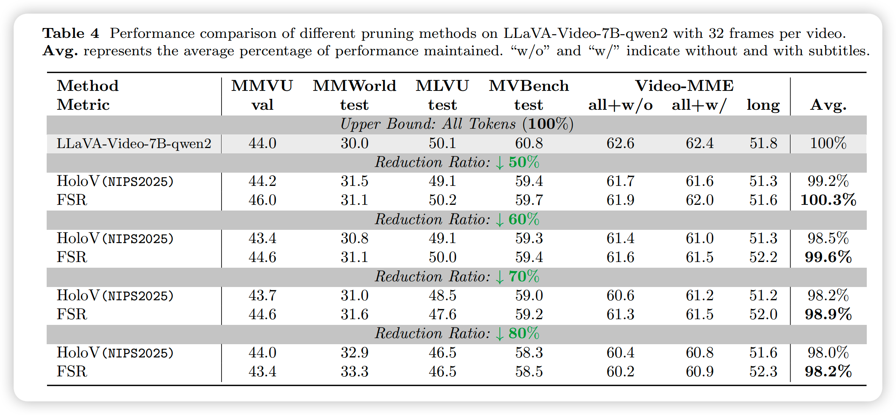
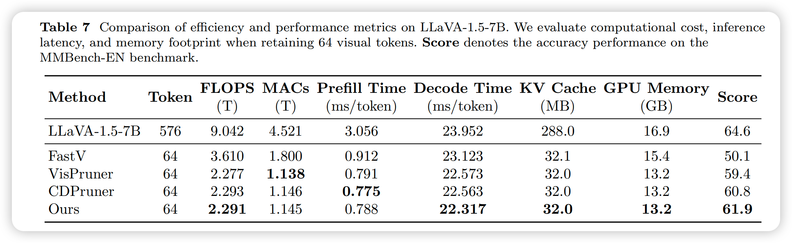

# Focus-Scan-Refine: From Human Visual Perception to Efficient Visual Token Pruning

**Enwei Tong**1, Yuanchao Bai*1, Yao Zhu2, Junjun Jiang1, Xianming Liu1

1Harbin Institute of Technology, 2Zhejiang University

---

## 📢 News
* **[2026-02-05]** Our paper "Focus-Scan-Refine: From Human Visual Perception to Efficient Visual Token Pruning" is now available! Code will be released soon.

## 📖 Abstract

Vision-language models (VLMs) often generate massive visual tokens that greatly increase inference latency and memory. While training-free token pruning offers a practical remedy, existing methods still struggle to balance local evidence and global context under aggressive compression.

We propose **Focus-Scan-Refine (FSR)**, a human-inspired, plug-and-play pruning framework that mimics how humans answer visual questions. FSR dynamically allocates a limited token budget through a three-stage process:

Extensive experiments show that FSR consistently improves the accuracy-efficiency trade-off across LLaVA-1.5, LLaVA-NeXT, Qwen2.5-VL, and LLaVA-Video.

## 🚀 Methodology

  

FSR mimics the human visual cognitive process ("Focus, Scan, then Refine") to efficiently prune visual tokens:

1.  **Focus (Local Evidence)**: Identifies critical regions by fusing visual saliency with instruction relevance, ensuring the model locks onto query-related objects.
2.  **Scan (Global Context)**: Expands the field of view using *Conditional Context Sampling (CCS)* to capture diverse background information that complements the focused area.
3.  **Refine (Aggregation)**: Instead of hard pruning, it aggregates discarded but relevant details into context anchors, preserving fine-grained textures without increasing the token budget.

---

## 📊 Performance

We extensively evaluate FSR on diverse benchmarks, covering standard benchmarks, high-resolution visual processing, advanced architectures, and video understanding.

### 1. 🏆 Standard Benchmarks (LLaVA-1.5)

On the widely used LLaVA-1.5-7B, FSR consistently outperforms state-of-the-art pruning methods (including HoloV, VisPruner, and CDPruner) across different pruning ratios.

  

### 2. 🖼️ High-Resolution Inputs (LLaVA-NeXT)

High-resolution models often generate massive redundant tokens. FSR effectively eliminates this redundancy. Notably, on **LLaVA-NeXT-13B**, FSR even slightly surpasses the original unpruned model at a 77.8% reduction ratio, suggesting that FSR effectively filters out noise.

  
  

### 3. 🚀 Advanced Architectures (Qwen2.5-VL)

We extended FSR to **Qwen2.5-VL-7B**, a stronger baseline with dynamic resolution support. FSR continues to lead, demonstrating strong generalization capabilities across different model architectures.

  

### 4. 🎥 Video Understanding (LLaVA-Video)

FSR generalizes effectively to the temporal domain. On **LLaVA-Video-7B-Qwen2**, FSR preserves critical spatiotemporal cues, achieving **99.6%** of the original performance while removing **60%** of the tokens.

  

### 5. ⚡️ Efficiency & Speedup

FSR delivers a superior accuracy-efficiency trade-off. By retaining only **64 visual tokens** (~89% reduction), it significantly reduces memory footprint and latency while outperforming other methods.

  

